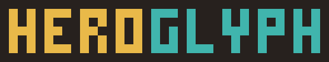

figlet in the pixel-art style of the [mini.nvim](https://github.com/nvim-mini/mini.nvim) logo: any text in its blocky 4x7 font, as terminal block art or a colored PNG. One POSIX `sh` file.

```
$ heroglyph "hello world"
█ █ ███ █   █   ███     █ █ ███ ███ █   ██
█ █ █   █   █   █ █     █ █ █ █ █ █ █   █ █
███ ██  █   █   █ █     ███ █ █ ██  █   █ █
█ █ █   █   █   █ █     ███ █ █ █ █ █   █ █
█ █ ███ ███ ███ ███     █ █ ███ █ █ ███ ██

$ heroglyph -o logo.png "hero:#E9B949" "glyph:#40B5AD"
```

`heroglyph -h` lists every flag. Read [DESIGN.md](DESIGN.md) for how it works and [ROADMAP.md](ROADMAP.md) for the plan.

## Install

```
make install               # ~/.local/bin/heroglyph
make install PREFIX=/usr   # or another prefix
```

Needs POSIX `sh` and `awk`; `-o` also needs ImageMagick 7 (`magick`).

## Credits

Font and technique by **[Evgeni Chasnovski](https://github.com/echasnovski)**, author of [mini.nvim](https://github.com/nvim-mini/mini.nvim): every glyph is transcribed from [`logo-2/font/*.gif`](https://github.com/nvim-mini/assets/tree/main/logo-2/font) in [nvim-mini/assets](https://github.com/nvim-mini/assets) (MIT), and the palettes come from [mini.hues](https://github.com/nvim-mini/mini.nvim/blob/main/readmes/mini-hues.md). See [LICENSE](LICENSE).
